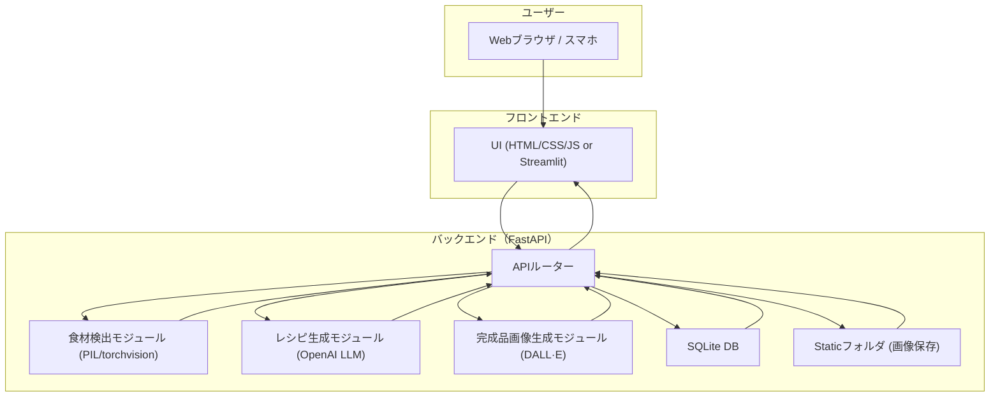

# アーキテクチャ設計書

## 📘 プロジェクト名

食材画像からレシピ提案アプリ

---

## 1. システム構成概要

本アプリは **FastAPI** を基盤とした Web アプリケーションであり、以下の構成要素から成る：

- **フロントエンド**：FastAPI + Jinja2（シンプルな HTML テンプレート）または React/Streamlit（将来拡張）
- **バックエンド**：FastAPI（API ルーティング・処理）
- **AI 連携**：OpenAI API（LLM: GPT-4o-mini、画像生成: DALL·E）
- **画像解析**：Python ライブラリ（PIL, torchvision 等）
- **データベース**：SQLite（レシピ保存用）
- **ストレージ**：アプリ内 `static/` ディレクトリ（生成画像の保存）

---

## 2. システム構成図

## 3.コンポーネント構成

### 1.UI 層

- ユーザーが利用する画面（アップロード、結果表示、保存レシピ一覧）

### 2.アプリケーション層

- FastAPI のルーターがリクエストを受け取り、各モジュールへ処理を振り分ける

### 3.ドメイン層

- 食材検出処理

- レシピ生成処理

- 画像生成処理

### 4.データ層

- SQLite DB：レシピ・タグ・お気に入り情報を保存

- static/：生成画像をファイルとして保存

## 4. 技術選定理由

- FastAPI：軽量・非同期処理対応・初心者でも学びやすい

- OpenAI API：高精度な食材認識（テキスト変換）と自然言語によるレシピ生成

- DALL·E：食材やレシピに基づく完成品イメージを生成可能

- SQLite：軽量でシングルユーザー利用に最適。将来は PostgreSQL などに移行可能

- PIL / torchvision：画像処理の基礎ライブラリとして利用しやすい
