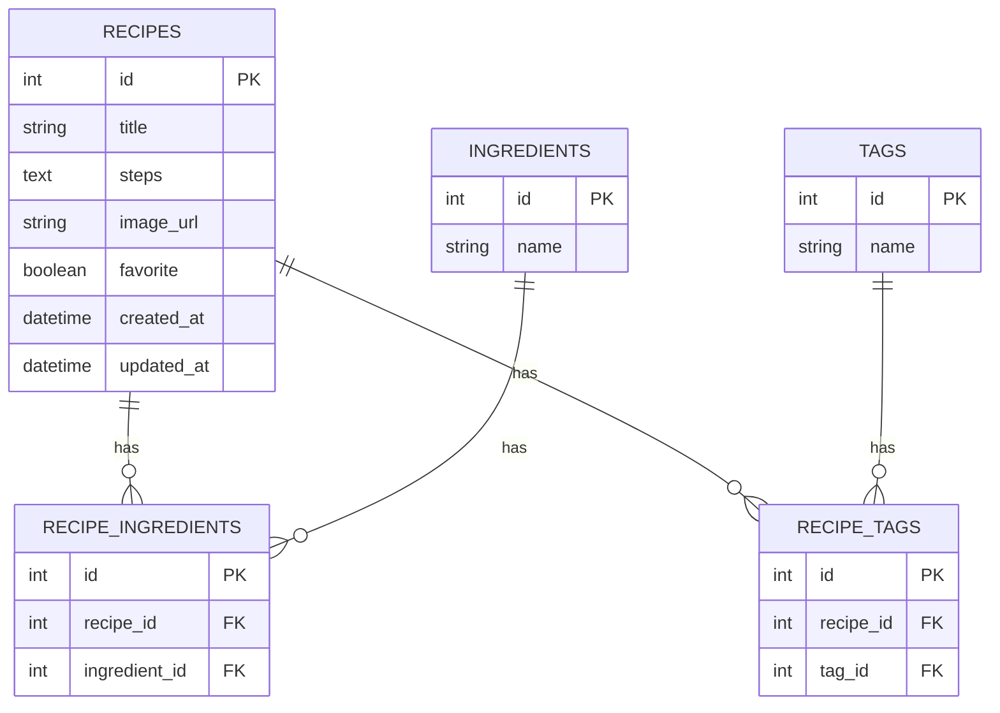

# ER 図（データベース設計）

## 📘 プロジェクト名

食材画像からレシピ提案アプリ

---

## 1. テーブル一覧

1. **recipes**（レシピ情報を管理）
2. **ingredients**（材料を管理）
3. **recipe_ingredients**（レシピと材料の中間テーブル）
4. **tags**（レシピに紐づくタグ）
5. **recipe_tags**（レシピとタグの中間テーブル）

---

## 2. ER 図（Mermaid）

## 3.テーブル仕様

### 3.1 recipes

- レシピ本体を管理

- 主キー: id

- 保存情報: 料理名、手順、生成画像のパス、作成日・更新日、お気に入りフラグ

## 3.2 ingredients

- 食材名を一元管理

- 主キー: id

- 重複を避けるため name はユニーク制約を推奨

### 3.3 recipe_ingredients

- 多対多関係を解決する中間テーブル

- 主キー: id

- recipe_id と ingredient_id を外部キーとして保持

### 3.4 tags

- レシピに紐づけるタグを管理

- 主キー: id

- 例: 「カレー」「スープ」「時短」

### 3.5 recipe_tags

- 多対多関係を解決する中間テーブル

- 主キー: id

- recipe_id と tag_id を外部キーとして保持
